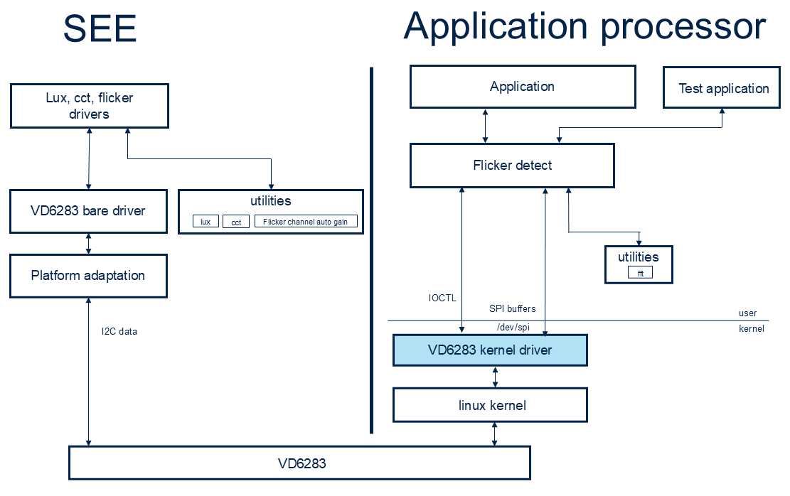
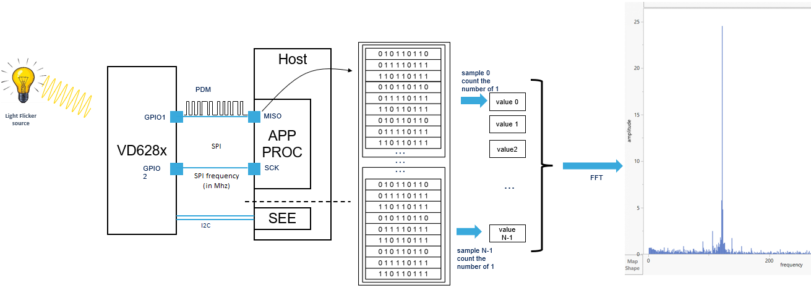

# STSW-VD6283-XR
Linux kernel driver for VD6283 for xr2gen3 Qualcomm reference design platform

This linux kernel driver implements a bridge that conveys SPI data in a context of a wider software package.
This software package implements the 3 features the VD6283 device is capable of : cci, lux and flicker detection. 

The following diagram describes a software overview. 

The VD6283 is connected through I2C to the sensor hub processor. 
The sensor hub processor then controls the device (initialization, start, stop) and calculates lux and cct from the light counters information extracted from the i2c channel.
It also sends the START and STOP commands to control the flicker channel.

The clear channel of the vd628x device is used to detect and extract the frequency of the ambient light
As described in the figure above the SPI bus of the processor to which the VD6283 device is connected to, gets PDM data from GPIO1 at the same frequency of the SPI bus.

